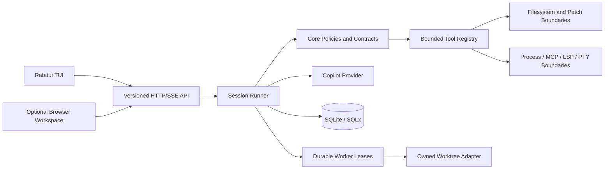

# DevFoundry

DevFoundry is a local-first coding agent built in Rust. It combines a
Ratatui terminal client, a versioned HTTP/SSE API, durable SQLite state, safe
filesystem and process tools, and an optional browser workspace. GitHub Copilot
is the current provider boundary.

> **Project status:** active development. The repository has a strong local
> validation baseline, but it is not claiming full production readiness. See
> [`docs/PENDING_WORK.md`](docs/PENDING_WORK.md) for the remaining product,
> platform, provider, and release gates.

## Highlights

- TUI-first interaction with prompt editing, transcript rendering, permissions,
  reconnect, terminal projections, and cleanup paths.
- Durable sessions, events, attempts, permissions, worker leases, recovery,
  backups, and portable session export/import in SQLite.
- Copilot-compatible streaming provider with bounded output, cancellation,
  retry classification, and secret-free diagnostics.
- Explicit permission boundaries around shell, filesystem, MCP, LSP, PTY,
  preview, worktree, and resource operations.
- Optional browser workspace for chat, tasks, documents, workers, terminals,
  and previews.
- Native macOS Keychain support through `keyring` with binding validation and
  fail-closed behavior on unsupported platforms.

## Architecture



The detailed component map and request lifecycle are in
[`docs/architecture.md`](docs/architecture.md). The original planning record
is preserved in [`docs/planning/02-system-architecture.md`](docs/planning/02-system-architecture.md).
The interactive Archify version is available at
[`docs/architecture/devfoundry-architecture.html`](docs/architecture/devfoundry-architecture.html).

## Repository Map

| Path | Responsibility |
| --- | --- |
| `crates/schema` | Stable IDs, contracts, exports, and shared data types |
| `crates/protocol` | Versioned API, SSE, lifecycle, and wire contracts |
| `crates/core` | Session, policy, context, task, and secret-binding domain rules |
| `crates/storage` | SQLite repositories, migrations, events, recovery, and backups |
| `crates/tools` | Permissioned filesystem, process, MCP, LSP, PTY, preview, and resource tools |
| `crates/llm` | Provider-neutral streaming contracts and Copilot transport |
| `crates/server` | Axum routes, authentication, origin policy, SSE replay, and worker assignment |
| `crates/tui` | Terminal state, transcript projections, permissions, and client transport |
| `crates/devfoundry` | CLI entry point, runtime wiring, configuration, and smoke commands |
| `apps/workspace` | Optional Vite/TypeScript browser workspace |
| `docs` | Architecture, security, planning, release, validation, and task records |

## Quick Start

Requirements: Rust 1.88 or newer, SQLite build prerequisites, and Node.js/npm
for the optional browser workspace.

```bash
git clone https://github.com/joy-gajjar/devfoundry.git
cd devfoundry
cargo run -p devfoundry -- doctor
cargo run -p devfoundry
```

The CLI defaults to the current directory. The interactive TUI does not read
ambient provider credentials into child tools. Configure provider settings in
the project configuration and follow [`docs/credentials.md`](docs/credentials.md)
for credential boundaries.

### API server

```bash
cargo run -p devfoundry -- serve --bind 127.0.0.1:4096 --database .devfoundry.db
```

Loopback defaults are intentionally convenient for local development. Binding
outside loopback requires the authentication and exact-origin policy described
in [`docs/security.md`](docs/security.md).

### Browser workspace

```bash
cd apps/workspace
npm ci
npm run dev
```

The browser workspace is a projection client, not a replacement for the TUI or
the server trust boundaries.

## Local Validation

Rust gates:

```bash
cargo fmt --all -- --check
cargo check --workspace --all-targets
cargo clippy --workspace --all-targets -- -D warnings
cargo test --workspace
bash scripts/validate-secretless.sh
```

Browser gates:

```bash
cd apps/workspace
npm run typecheck
npm test
npm run build
npx playwright test
```

Dependency policy:

```bash
cargo audit
cargo deny check
```

The audit exception for inactive SQLx PostgreSQL metadata is documented in
[`.cargo/audit.toml`](.cargo/audit.toml) and [`docs/tasks/080-native-credential-backend.md`](docs/tasks/080-native-credential-backend.md).

## Demo

Use the reproducible walkthrough in [`docs/demo.md`](docs/demo.md). It covers
the browser workspace, TUI startup, API health, and the deterministic Copilot
mock smoke without requiring a credential. A hosted demo video is not claimed
until a secret-free recording is produced and published.

## Security and Credentials

DevFoundry treats provider credentials as a permission-bound secret boundary.
Secrets are not serialized into session exports, diagnostics, logs, browser
bootstrap data, or child-process environments. See:

- [`SECURITY.md`](SECURITY.md)
- [`docs/security.md`](docs/security.md)
- [`docs/credentials.md`](docs/credentials.md)
- [`docs/support-matrix.md`](docs/support-matrix.md)

## Contributing and Releases

- Development workflow: [`CONTRIBUTING.md`](CONTRIBUTING.md)
- Architecture: [`docs/architecture.md`](docs/architecture.md)
- Roadmap and remaining work: [`docs/PENDING_WORK.md`](docs/PENDING_WORK.md)
- Release process: [`docs/release.md`](docs/release.md)
- Support matrix: [`docs/support-matrix.md`](docs/support-matrix.md)
- Release verification: [`docs/release-verification.md`](docs/release-verification.md)

The GitHub Actions workflow runs Rust, browser, secretless, macOS, and Windows
checks. Live Copilot credentials, artifact signing, package publication, and
some platform evidence remain explicit external gates.

## License

This project is licensed under the MIT License. See the repository history and
release records for current ownership and publication status.
