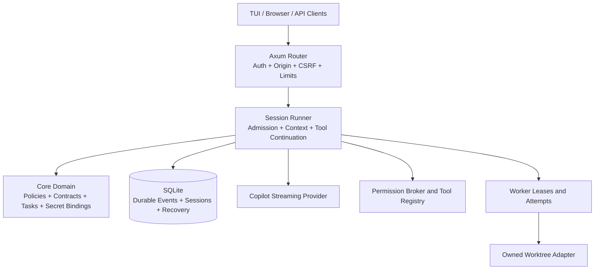
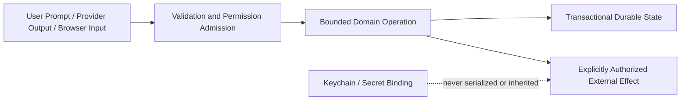

# DevFoundry Architecture

This document is the concise public architecture map. Detailed design
decisions, task records, and gates remain under [`planning/`](planning/) and
[`tasks/`](tasks/).

## System Boundaries

## Crate Responsibilities

- `schema` owns cross-component IDs and serialized domain contracts.
- `protocol` owns versioned HTTP JSON, SSE envelopes, lifecycle responses, and
  replay cursors.
- `core` owns domain invariants that must not depend on the transport or CLI.
- `storage` owns SQLx/SQLite migrations, repositories, durable events, leases,
  recovery, backups, and bounded history queries.
- `tools` owns capability-specific permission admission and bounded external
  side effects. Tool operations do not inherit arbitrary provider credentials.
- `llm` owns provider-neutral streaming and the GitHub Copilot-compatible
  transport, including cancellation and typed error classification.
- `server` maps protocol contracts to stateful routes and server-side
  execution/recovery boundaries.
- `tui` reduces durable API events and local terminal events into an explicit
  transcript and permission state.
- `devfoundry` assembles the CLI, configuration, runtime, smoke commands, and
  application entry points.

## Request Lifecycle

1. A client submits a bounded prompt or lifecycle request to the API or local
   TUI transport.
2. The server validates authentication, origin, payload size, session identity,
   and idempotency/admission fields.
3. Storage commits the authoritative admission and durable event state.
4. The session runner assembles bounded context and invokes the Copilot provider
   through the provider-neutral stream contract.
5. Tool calls require their own capability and permission boundary before any
   filesystem or process side effect.
6. Events are committed before live fanout; reconnecting clients use durable
   replay and state queries rather than relying only on an in-memory stream.
7. Worker leases and attempts record evidence separately from acceptance. An
   interrupted or restarted worker is recovered as an unknown outcome rather
   than silently rerun.

## Trust Boundaries

- Provider output is data, not permission.
- Browser state is a projection and cannot bypass API origin, CSRF, or
  permission checks.
- Secret resolution requires a binding request validated against an
  authoritative binding before the native backend reads a credential.
- Worktrees are ownership boundaries, not OS sandboxes.
- Archive/resource inputs are staged and validated before publication.

## Data and Recovery

SQLite stores sessions, messages, events, tool calls, permission requests,
worker leases, attempts, evidence, resource metadata, and notification state.
Transactions establish durable truth before live event publication. Startup
recovery marks interrupted work explicitly and avoids automatic replay of
non-idempotent side effects.

## Optional Browser Workspace

`apps/workspace` is a Vite/TypeScript client with browser tests and Playwright
coverage. It presents chat, tasks, documents, workers, terminals, and previews
as bounded projections. The browser is intentionally not a second server or a
credential authority.

## Agent Configuration and Worker Visibility

The first Boss/Worker UI slice uses layered JSON configuration without moving
security policy into user-editable files:

- Global defaults: `${XDG_CONFIG_HOME:-$HOME/.config}/devfoundry/config.json`.
- Project compatibility/configuration: `<project>/devfoundry.json`.
- Project values override global values; missing values use built-in defaults.
- Built-in profiles are `boss`, `build`, `plan`, `review`, and `test`.
- The TUI exposes Agent Settings and a read-only Worker Dashboard.

`boss` currently expresses delegation intent and worker limits; it does not
automatically decompose prompts, spawn workers, merge worktrees, or accept
results. Worker evidence remains distinct from acceptance. Custom plugin
agents, merge/conflict UI, and automatic orchestration remain deferred.

## Current Deferred Areas

This architecture does not claim completion of the full product backlog. The
remaining work includes live provider evidence, restart-safe external process
reconciliation, native PTY behavior on all supported platforms, release
artifact signing/publication, and broader product features. Track these in
[`docs/PENDING_WORK.md`](PENDING_WORK.md).
